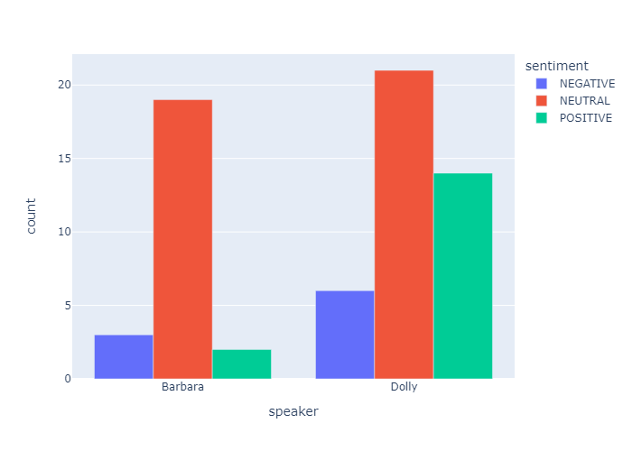

# America's Sweatheart, Dolly Parton
Dolly Parton has a number of popular interviews across the web. Since her youth, Dolly has embodied the image of "country class" and pressed it into the heart of America.

## Interview with Barbara Walters
We analyze the famous interview of Dolly Parton by Barbara Walters (1977).
This short 5minute segment of interview was  garnerd millions of views on youtube. Many hail this interview as the hallmark of the class and character of Dolly Parton.

At first it we may notice, suprisingly, Dolly has twice the negativity assigned to her in this interview. It's important to remember however Dolly should be the one speaking more as the one being Interviewed. Further, we may look to Dolly's positivity. 

<h3 class="primary-compare">34% of Dolly's speech is recognized as Positive</h4>

    Compared to Barbara's 8% of positive speech.

Let us also look at the two speakers most frequently used words
 
Barbara's Top 5 words: <strong>Think, Look, Blonde, Wig, Wear</strong>
<strong>4/5</strong>of Barbara's top 5 words are about appearence. This may lay a basis for a line of communication which could appear vain to the audience. In addition, the word "hillbilly" 
would by most accounts be seen as a highly negative word.

Let's compare it to Dolly 
 
Dolly's top five words tend towards people and action. Her top words don't include any words that appear inherently negative. 
With Dolly's top words including: care, kind, joke, class and, freedom. All words which would usually tend towards positive connotations. 

Let's take a wordcloud from another Dolly Interview 
 
Again here we see Dolly's speech follows the same trend. Her words tend towards things or action. 